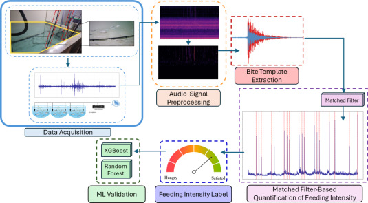

# Optimized aquaculture feeding through matched-filter audio signal processing and machine learning

**Authors: [Dror Ettlinger-Levy](https://www.semanticscholar.org/author/Dror-Ettlinger-Levy/2404163211), [S. Kendler](https://www.semanticscholar.org/author/S.-Kendler/34198721), [Iris Meiri Ashkenazi](https://www.semanticscholar.org/author/Iris-Meiri-Ashkenazi/2409508571), [Shay Tal](https://www.semanticscholar.org/author/Shay-Tal/2404216128), [B. Fishbain](https://www.semanticscholar.org/author/B.-Fishbain/47133884)**


**Matched-filter–based continuous regression framework for quantifying gilthead seabream feeding intensity from passive acoustic signals, validated via tree-based machine learning models**



---

##  Paper Overview

This study introduces and validates a domain informed acoustic framework for continuous fish feeding quantification in aquaculture:
- **Matched filter signal processing pipeline** for extracting species specific bite events and generating a continuous feeding intensity label
- **Tree based regression models** (XGBoost and Random Forest) for validating the biological and environmental consistency of the derived intensity signal

The approach combines physics grounded signal detection with machine learning regression, enabling scalable, real time feeding optimization and welfare monitoring in aquaculture systems.

### Research Question

*Can domain informed matched filtering transform raw passive acoustic recordings into a biologically meaningful continuous feeding intensity signal that aligns with environmental and behavioral drivers in aquaculture systems?*

---

## Project Objectives

### Primary Objectives

1. **Continuous Feeding Quantification**: Develop a scalable acoustic pipeline for real time estimation of fish feeding intensity
   - Passive acoustic monitoring over multi day recordings (48 kHz, 24 bit, 19 days, 3 tanks, 2 hydrophones each)
   - Species specific bite template extraction (4462 Hz max power, 5138 Hz spectral centroid)
   - Matched filter with sliding window aggregation (2048 sample FFT window, 512 hop, 2048 Hz high pass, 0.01 threshold, 10 min window, 6 s step)
   - Continuous regression based feeding intensity label

2. **Domain Informed Signal Design**: Leverage biological knowledge to reduce data dimensionality while preserving behavioral information
   - Physics grounded matched filtering for bite detection (SNR up to 16× higher than random templates)
   - Noise reduction via spectral gating and high pass filtering (2048 Hz Butterworth filter)
   - Data compression from high frequency waveforms to single event level numeric labels (~10^8 raw samples per event reduced to 1 intensity value)

1. **Biological and Environmental Validation**: Evaluate whether the derived intensity signal reflects real aquaculture dynamics
   - Regression modeling with XGBoost and Random Forest (80/20 split, 10 fold CV, 50 estimators)
   - Feature importance analysis for time since feeding, age, and time of day
   - Quantitative performance assessment using R², RMSE, and confidence intervals


### Implementation Goals

- Modular acoustic processing pipeline
- Fully reproducible experimental workflow
- Comprehensive performance logging
- Standardized regression comparison framework

---

##  Implementation Details

### Task Definition

**Input:** Continuous preprocessed acoustic waveform (48 kHz, 24 bit)
**Intermediate:** Matched filter response and sliding window aggregation
**Output:** Continuous feeding intensity label:

- Peak matched filter count per feeding event (0 to 650 range)
- Normalized daily intensity signal

**Evaluation:** Regression performance metrics (R², RMSE, MAE)

### Dataset

**Source:** National Center for Mariculture experimental system, Eilat, Israel
- **Size:** 6 channels, 19 days, 34,040,217,600,000 data points
- **Stocking:** 30 gilthead seabream per tank, initial weight ≈ 40 g
- **Sampling:** 48 kHz, 24 bit continuous acoustic recording
- **Split:** 80% train, 20% validation

### Matched Filter Regression Architecture

**Model:** Matched Filter Regression Pipeline

```
Input: 1D acoustic waveform
  ├─ 6 channels: tanks (3) + hydrophons (2) + days recording (19) 
  └─ 48 kHz sr × 24 bit resolution

Architecture:
  ├─ Spectral Gating: STFT window 2048 → Hop 512, Threshold 1.5 SD
  ├─ High Pass Filter
  │   └─ 2048 Hz Butterworth
  ├─ Matched Filter
  │   ├─ Bite template 4462 Hz max power
  │   ├─ Spectral centroid 5138 Hz
  │   └─ Detection threshold 0.01
  ├─ Sliding Window Aggregation
  │   ├─ 10 x 6 x 1000 (min window, s step, sample averaging)
  └─ Regression Heads
      ├─ XGBoost 50 estimators
      └─ Random Forest 50 estimators

Samples: 2.04 x 10^14
Memory (FP16): 16.78 TB
Data Reduction: 10^8 samples → 1 intensity value per event 
```

**Key Features:**

- Physics grounded template matching
- High signal to noise amplification
- Extreme data dimensionality reduction
- Continuous regression based intensity output

---

##  Training Configuration

### Hyperparameters (Identical for Both Models)

```yaml
Model: XGBoost
	- n_estimators: 50
	- max_depth: 5
	- learning_rate: 0.1
	- subsample: 0.8

Model: Random Forest
	- n_estimators: 50
	- max_depth: None
	- min_samples_split: 2

Training:
	- Optimization: Grid search with 10-fold KFold cross-validation
	- Evaluation metric: Mean Squared Error (MSE)
	- Train/test split: 80/20

```

### Training Results

**XGBoost Model (Cross-Validated):**
- $R^2$: $0.8957 \pm 0.0849$
- RMSE: $0.0655 \pm 0.0241$
- MAE: $0.0425 \pm 0.0184$

**Random Forest Model (Cross-Validated):**
- $R^2$: $0.8961 \pm 0.0835$
- RMSE: $0.0654 \pm 0.0224$
- MAE: $0.0425 \pm 0.0193$

**Both models show:**
- Strong and consistent predictive performance with high explainability.    
- Low prediction errors across the dataset.
- Stable and reliable model performance, confirmed by 95% confidence intervals.
- Robust residual diagnostics, indicating normality and no evidence of heteroscedasticity.
